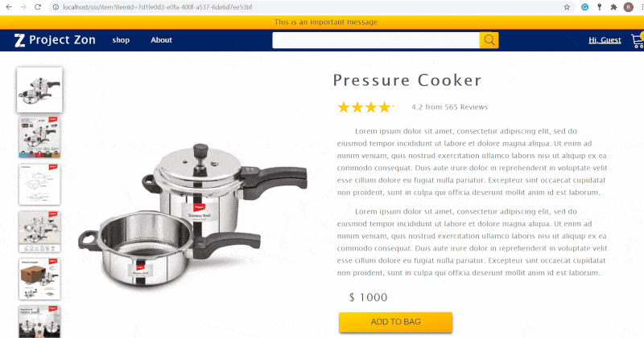

# Project Rainforest

This is a demo javascript Ecommerce Marketplace web aplication. This was created as a testbed explore few different technologies.

## API

API is a typical Layered monolithic architecture. It uses PostgreSQL as a database. This was my attempt at creating a propper architecture with most of the components required to create a ecommerce marketplace like Customer, Sellers, Contacts, items, orders, reviews, their relationship with each other at a database level, error handing, authentication and functional testing.

## Client

Client is a react appplication with redux for global state management, sass for styling and webpack for bundling. This application was built without any bootstrap or any third-party component library. The components are custom built mostly reusable components.

Other highlighting feature of the application is, 
- It is a server side rendering application with code splitting on multiple routes on first load, but turns into a single page application with on screen navigation. 
- This was all achieved without Next.js but with features of webpack and a third party library that does not dictate the folder structure like Next.js

The application is also scalabe with respect to different screen sizes, also fares good performance wise and accessible to some extent (Didn't go all out in accessibility and TDD as I already had experience with it and the application was just a test bed for some technologies). Still, this application scored above 90 in lighthouse metrics on all areas except PWA.

## Starting the server in Development

The entire application with database and redis in development can be started with just a single command,

```bash
$ skaffold dev
```
For this you require 
- Docker
- Kubernetes with 'kubectl'
- ingress-nginx [(installation)](https://kubernetes.github.io/ingress-nginx/deploy/)
- Skaffold [(installation)](https://skaffold.dev/docs/install/)

The development environment is setup with the command. Skaffold builds the docker images, if there are any changes from the previous build and then configures all the deployments, services, ingress and even seeds the database in dev environment. 
For optimal development experience any change on the repository will be synced up with respective containers and changes will be reflected without any kubernetes or docker restarts.

## Client Demo



## Production if deployed

The Client is optimized for performance in production with minification, gzipping, post-css etc.

Running the database and redis cache on containers is only for development, but it is recommended to use third party service provided options for obvious reasons.

CI/CD can also be implemented with third party options like Github Actions and Travis.org or can be configured with jenkins on a custom container.

## Future
There will not be development on this application in the near future as it has served its purpose as a testbed and can only go so far on implementing new technologies on this architecture.

The goal is to work shift focus on experimenting and implementing production ready, cutting edge technology like serverless web applications, or use lambda functions for CI/CD in the next couple of years. But for the next coming months, focus will be on experimenting with well established modern architectures like event based microservice architecture, microFrontends etc.

